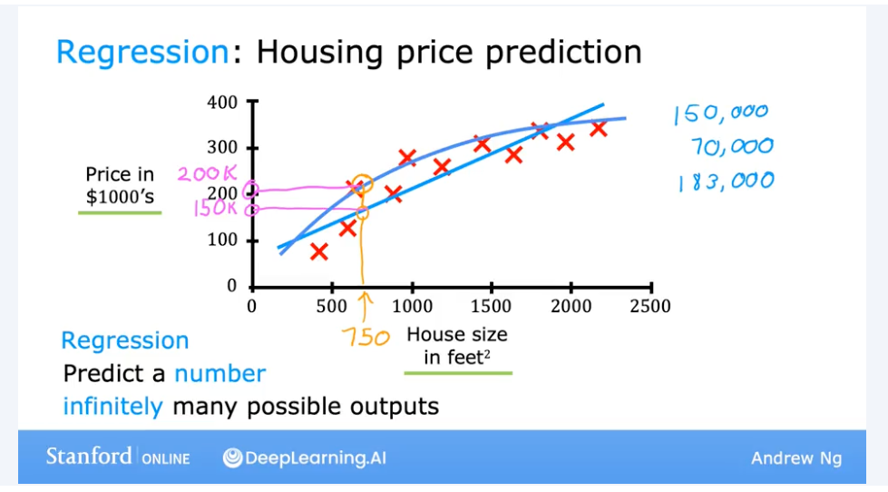
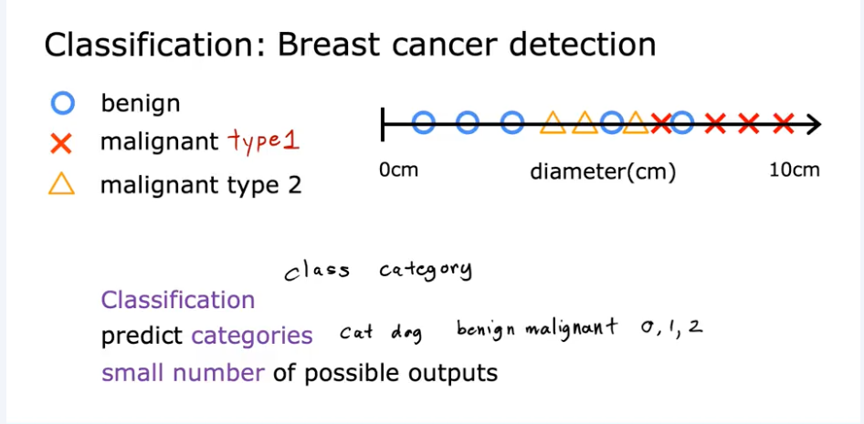
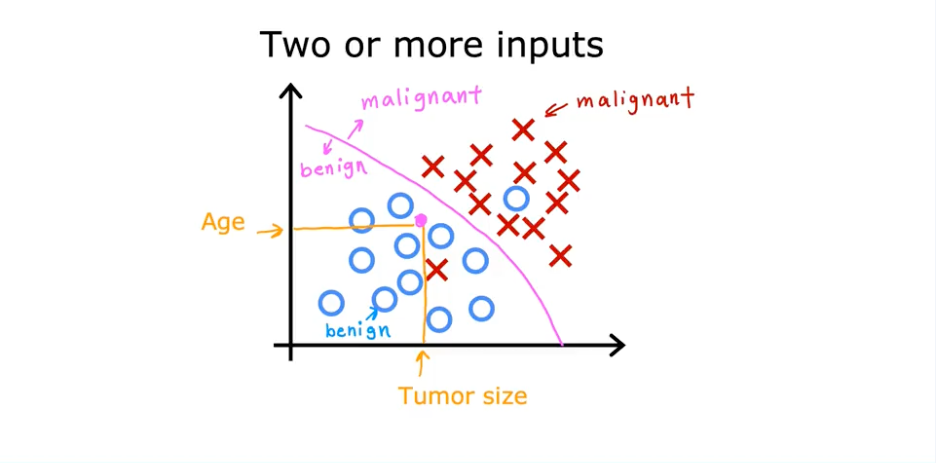
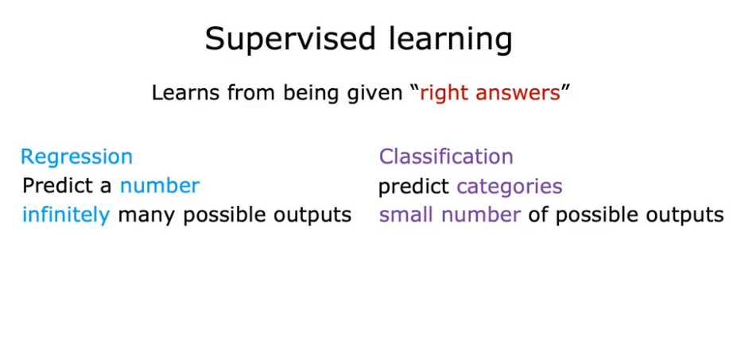
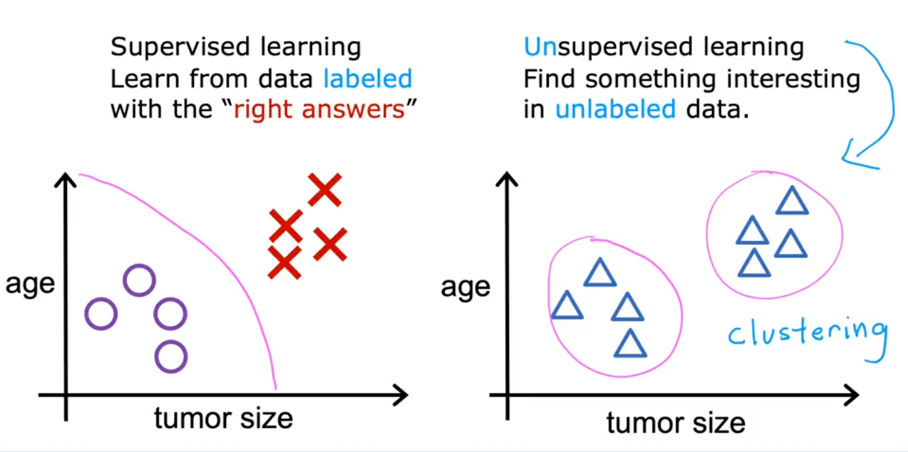
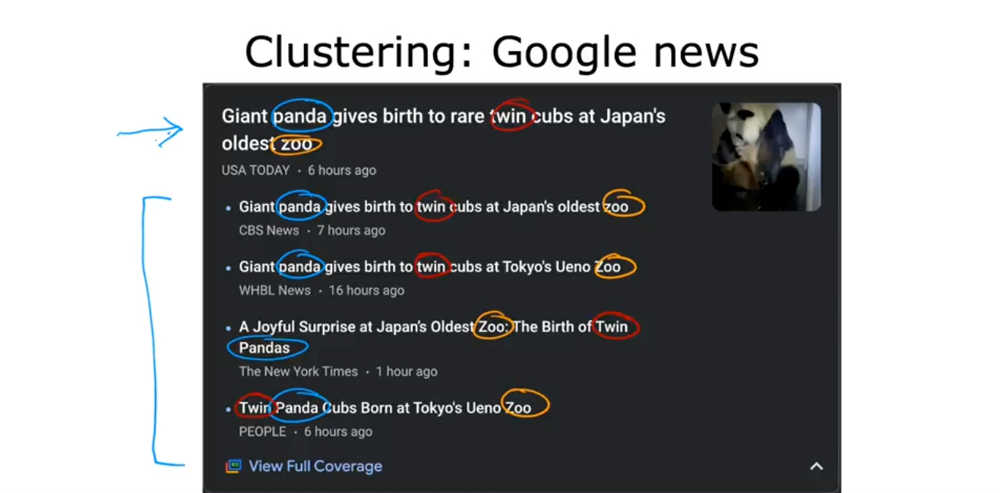

# Introduction to Machine Learning

## Supervised Learning

### What is supervised learning?

- Supervised learning is a type of machine learning where an input produces an output.
- Give the learning a dataset of the desired inputs and desired output labels and the learning algorithm eventually learns the write things to do.
- Eventually it will only need the input then it can determine the output.
- Regression is a type of supervised learning where as example trying to predict the price of a house from a chart of data. It is upto you to determine where the line on the chart should go.

### What is a classification Algorithm?

Example used: Breast cancer detection—diagnostic tool for doctors to figure out if a tumor is benign or malignant.

- Classification algorithms predicts categories/classes of outputs based on the input. 
- There are a small number of possible outputs, in the case of breast cancer it can be either benign(0) or malignant(1).
- It is also possible to have different types of outputs classes such as malignant(1) and malignant(2) and plot them on a straight line. 

- It is also possible to have multiple inputs to determine outputs.
- In the example of breast cancer detection, you can have the size of the tumor, the shape of the tumor, the location of the tumor, etc.
- These can be plotted onto a graph, and a boundary line can be drawn to separate the classes to determine what the output is.

Summary

## Unsupervised Learning

### What is unsupervised learning?

As opposed to supervised learning, unsupervised learning does not require a desired output. Instead, it relies on the algorithm to extract interesting information and pattens from the dataset. 

An example of unsupervised learning is clustering, where the algorithm groups similar data together. 

An example of clustering in practise is something like Google News, where it scans new articles and groups similar articles together.

Two other types of unsupervised learning are:

- **Anomaly Detection**: Finding unusual data points
- **Dimensionality Reduction**: Compressing data using fewer numbers

## Linear Regression Model

